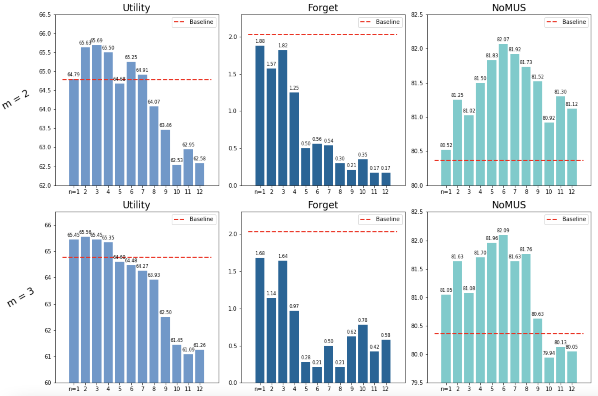

## < Effects of Hyperparameters n and m >

Experiment details:
- In this experiment, we explore various combinations of (n,m) values to see how they affect the performance of DASH.
- We use (ViT-B-16, MUFAC, Finetune) as the representative experiment setting in all ablation studies.
- We run each experiment with 10 random seeds and report the average for all ablation studies.
- We modify the total number of epochs to make the total train time approximately constant. Specifically, we use 20 epochs for m=2 and 15 epochs for m=3.

We observe the followings:
- [1] Across both values of m=2 and m=3, **n=6 (half the number of layers) exhibit the best overall unlearning performance.** This aligns with our findings from <a href="https://dash-kdd.github.io/Ablation-Study-2/" style="color: #006699; text-decoration: underline;text-decoration-style: dotted;">Ablation Study 2</a>, where a balanced trade-off between utility and forget quality is achieved at n=6.
- [2] The overall performance decreases after n = 6, suggesting that applying DASH to the bottom layers negatively affects the overall NoMUS score. From the figures above, we observe that this is because the forget score does not significantly improve while the utility degradation is relatively larger, leading to a lower NoMUS score.
- [3] There is a trend that as n increases, utility decreases while forget quality improves. This aligns with our intuition, as applying DASH to more layers removes more overfitted knowledge but may sacrifice utility.
- [4] The majority of pairs of (n,m) result in improved NoMUS performance compared to the baseline (red line), confirming the general effectiveness of DASH across various hyperparameter values. Additionally, forget quality consistently outperforms the baseline, validating the effectiveness of duplicating layers in removing stored knowledge.

We also notice a promising advantage of DASH:
- [5] (n,m) = (6,2) and (6,3) yield similar overall NoMUS scores (82.07 vs. 82.09), with (6,2) exhibiting better utility (65.25 vs. 64.48) while (6,3) showing better forgetting quality (0.56 vs. 0.21). **Hence, a certain degree of controllability exists in DASH.** Users can prioritize utility over forget quality by selecting (6,2), while those valuing forget quality over utility may opt for (6,3). This also aligns with our intuition: the more duplication, the more effective the removal of knowledge, albeit with a potential sacrifice in utility.

### Summary
***
* **n=6 is a sweet spot for DASH.** It strikes a balance between removing overfitted knowledge from upper layers and preserving general-level knowledge in the bottom layers, achieving a favorable outcome.
* The hyperparameters n and m behave somewhat in alignment with our intuition. As we increase duplication, a more effective removal of stored knowledge is possible, but concurrently, there is likely to be a decrease in utility. This happens because the gap between the original forward pass and the DASH forward pass widens.
* Based on the comprehensive exploration of the hyperparameters, we discovered a certain degree of **controllability** in DASH. For instance, users prioritizing utility can select (n,m) = (6,2), while those valuing forgetting quality may prefer (n,m) = (6,3). Both options yield nearly the same overall NoMUS score but emphasize either utility or forgetting.
